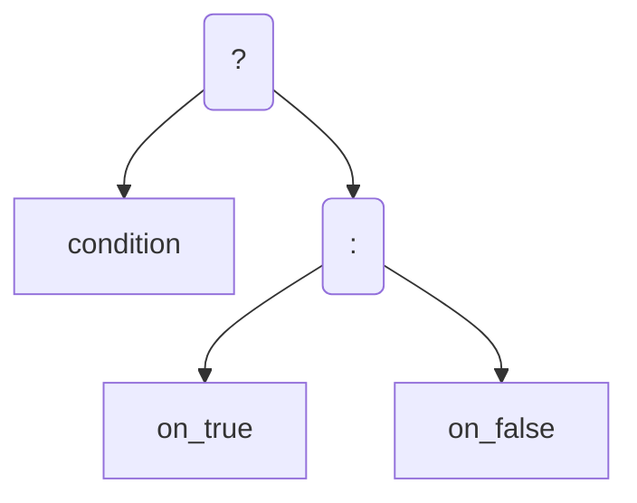
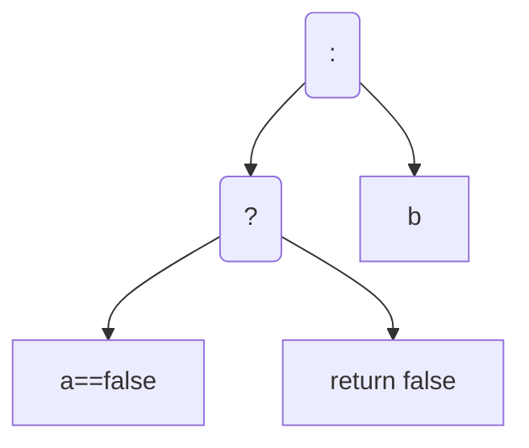
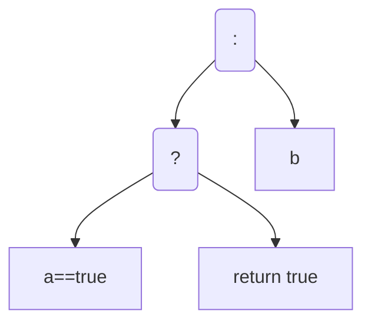
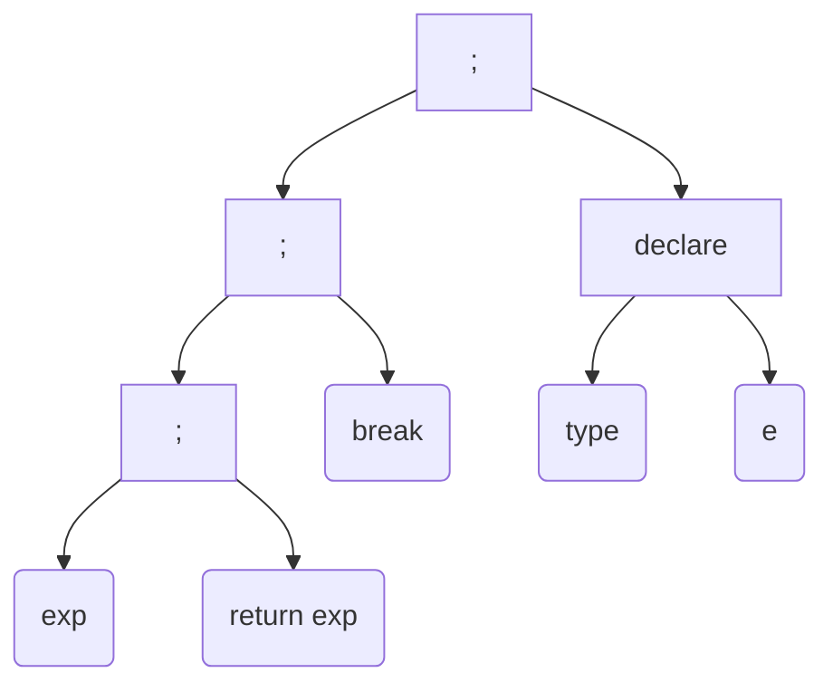

# 抽象语法树

1.   再树的构建时, 保留identifier还是reference直接上了?

     如果直接上了, 不够分层, 不够解耦, 增加代码的复杂新, 难以维护了

     如果分多个阶段, 分层, 那么就会导致反复循环, 有点效率损耗

2.   如果identifier要转成reference, 就可以分辨函数还是类型还是字段了

     如果是函数或者类型的话, 可以判断之后的`[`是`GENERIC_ARGUMENT`还是`AT_INDEX`了

3.   如果不行, 那就要再往后, 完全构建完毕整棵树之后, 遍历, 

     把Identifier转变成Reference, 并获取这个Identifeir是什么信息, 

     然后才能分辨`AT_INDEX`还是`GENERIC_ARGUMENT`

4.   如果不转换, 那么所有的`DOT` 也无法分辨`GET_MEMBER`还是`PATH`

5.   如果要转化

     1.   先分辨是`GET_MEMBER`还是`PATH`
     2.   从`IdentifierManager`分辨是什么idneitifer是局部变量还是成员, 是类型还是函数
     3.   分辨完毕之后制造Reference, 并存入库
     4.   如果知道是什么之后, 就可以分辨`At_INDEX`还是`GENERIC_ARGUMENT`了

6.   如果要在同一阶段做的话

     -   把Arguments列表构建完毕之后, 从Stack里pop出一个INVOKE的树

         本来是把这个Argument列表直接放到INVOKE的右子树上的

         现在把Argument上的所有右子树上的逗号都统一到INVOKE的列表上

         这样确实一个循环就能完成了的

7.   有局限性! 

     就是要分辨Identifier的话, 就涉及GET_MEMBER

     GET_MEMBER那涉及函数的返回值, 

     要知道函数的返回值, 就需要知道函数的签名

     要获取函数的签名就需要先解析Arguments

     还要知道Arguemnts的类型

     要知道Arguments的类型

     而且函数的

     首先第一个函数的获得, 一定是静态的, 或者是从前面的value的成员函数, 那能获得, 然后Argument需要统一分析, 

```
构建抽象语法树的时候, 我有两个策略: 第一个策略: 在遍历表达式的时候, 一边遍历, 一边构建, 一边进行类型检查, 查找Identifier是局部变量还是成员变量, 是类型还是函数还是字段, 一趟遍历完成上面工作. 第二个策略: 第一次遍历表达式, 不看这个类型的运算是否可行, 只看结构是否能构建起抽象语法树, 构建完毕抽象语法树后, 遍历抽象语法树, 查看Item是Identifier的话, Identifier是函数还是字段的分析并标注, 完成Identifer的标注后, 再次遍历抽象语法树, 进行类型检查. 以上两种策略, 第一种策略, 多个功能高度耦合, 可维护性差, 但是只要遍历一遍, 而且如果语法出现问题马上可以抛出异常中断程序, 不用等到后面才能检查出来. 第二种策略, 反复遍历, 而且是遍历树, 反复做同一个工作, 降低了效率, 但是完成了解耦, 每一个工作层次分明, 便于维护. 请分析上面两个策略, 思考我应该使用哪个策略更好, 如果你有比这两个策略更好的策略, 或者说前人在构建抽象语法树的时候有什么好的经验, 请告诉我
```

答: 大项目 第二种好!

## 表达式

### 基础


### 条件表达式 ? :

>   exp ? exp : exp

逻辑更清晰的表达:



更符合优先级的表达:

-   前提是, `:`的左子树一定是`?`

    ```mermaid
    graph TD
    
    OPER_CHOOSE(:)-->OPER_CONDITION
    OPER_CONDITION(?)-->condition
    OPER_CONDITION-->on_true
    OPER_CHOOSE-->on_false
    ```

-   


### 逻辑表达式的提前跳出

逻辑表达式到if的转变, ? : 同样有只执行一边的作用

#### && 

>   a && b -> a==false?false:b



#### ||

>   a || b -> a==true?true:b




### 括号和函数调用和index-at

函数增加`INVOKE`运算符, index-at增加at运算符, 转化为二元的表达式

用逗号形成一个实际上的链表, 还是收束到最上层的invoke? 第一阶段先不收束, 后面再收束吧

对于函数, 有identifier, 有 generic list, 又有argument, 如何是好?

虽然应该会被翻译成


### path 和 GetMember

-   path是一个静态的概念
-   GetMember是动态的


### 复合表达式

#### ArrayInitialization

本质是链表

-   `a = {1,2,3,4,5}`

    以下是`,`是右结合的, 

    ```mermaid
    graph TD
    =-->a
    =-->array_init
    array_init-->E1(,)
    E1-->1
    E1-->E2(,)
    E2-->2
    E2-->E3(,)
    E3-->3
    E3-->E4(,)
    E4-->4
    E4-->5
    
    ```

    


#### new Instance

1.   读关键字 new

2.   往下再读一个类型/读到括号

3.   如果没有 type, 那就审查上下文, 看看能不能分析出type

4.   如果有, 那pass

     ```mermaid
     graph TD
     new-->type
     new-->arguments
     ```

     


#### structure clone

什么样strucure_clone是合理的


#### lambda


#### cast


## 控制结构

控制结构转化成抽象语法树

### 顺序

```
//                  ;
//          ;           declare
//      ;       break    type   exp
//  exp     return
//              exp
```




### 分支

#### if-else

```java
if(condition)block;
else if(condition) block;
else if(condition) block;
else block;
end
```

-   图:

    ```mermaid
    graph TD
    
    
    subgraph 1
    IF1(if)
    CONDITION1(condition)
    BLOCK1(block)
    IF1-->CONDITION1
    IF1-->BLOCK1
    CONDITION1-->TRUE1[[true]]-->BLOCK1
    CONDITION1-->FALSE1[[false]]
    end
    
    subgraph 2
    IF2(if)
    CONDITION2(condition)
    BLOCK2(block)
    IF2-->CONDITION2
    IF2-->BLOCK2
    CONDITION2-->TRUE2[[true]]-->BLOCK2
    CONDITION2-->FALSE2[[false]]
    end
    
    
    subgraph 3
    IF3(if)
    CONDITION3(condition)
    BLOCK3(block)
    IF3-->CONDITION3
    IF3-->BLOCK3
    CONDITION3-->TRUE3[[true]]-->BLOCK3
    CONDITION3-->FALSE3[[false]]
    end
    
    ELSE1(else)
    ELSE2(else)
    ELSE3(else)
    BLOCK4(block)
    
    ELSE1-->IF1
    ELSE1-->IF2
    ELSE2-->ELSE1
    ELSE2-->IF3
    ELSE3-->ELSE2
    ELSE3-->BLOCK4
    
    
    
    FALSE1-->IF2
    FALSE2-->IF3
    FALSE3-->BLOCK4
    
    BLOCK1-->END
    BLOCK2-->END
    BLOCK3-->END
    BLOCK4-->END
    
    ```

-   else 的 左子树是 自己的前一个 if

#### switch-case

不好构建树

就是switch=case表[condition:jmp]

### 流程